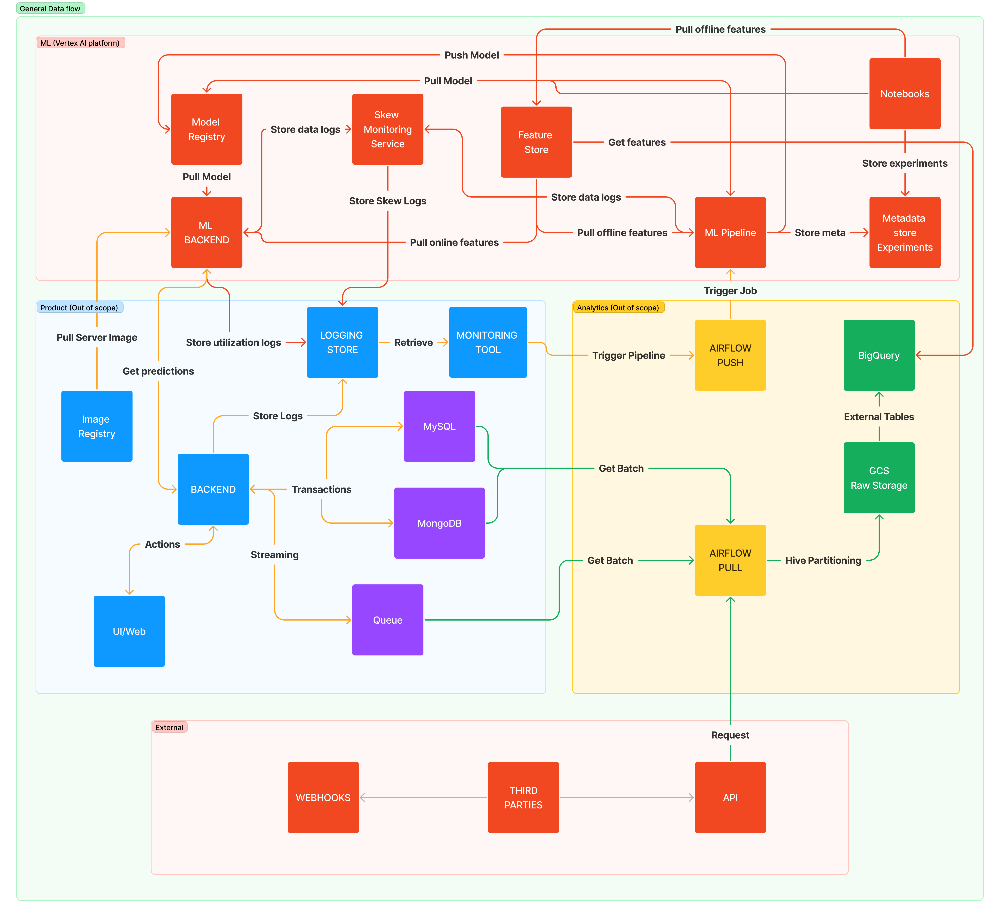
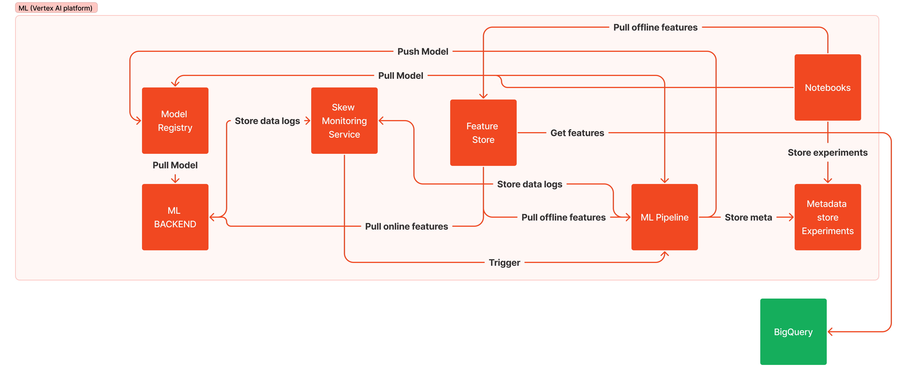

# ml-design-doc

## Project Description

**Problem Statement**

The company wants to expand its use of machine learning for content moderation but currently lacks a solid framework for retraining models, monitoring, and experimenting. Current methods are limited to local setups (local training, validation, etc.), causing inefficiencies in deployment, monitoring, and versioning. There is no reliable offline inference solution, and monitoring delays make issue detection slow.

**Objectives**

- **User Scam Classifier**: Develop and deploy a user scam classifier to efficiently detect and prevent fraudulent activities on the platform. This classifier will help reduce the number of false positive cases that moderators need to check, improving the accuracy of scam detection.

- **Establish Offline Inference Process**: Implement a reliable offline inference solution to handle batch processing and analysis on-demand. The process should run batch inference/training jobs on-demand triggered by external Airflow orchestrator. There should be monitoring ability that can run automatic retraining of the model and perform release. Another request is to be able work and combine different features because they can be reused by different models.

- **Adjust Online Inference Process**: Improve the current online inference process to perform automatic retraining flow as for offline inference, use model versioning, and experiment framework.

## High-Level Design

**Diagram of the overall system architecture (data flows, components, and interactions).**

*Detailed description of the components is located in the service decomposition section*

Full Design (Including out of scope parts)

PoC Design (Includes only parts that will be handled in this project)

**Description of the ML models involved, including short description.**

- **User Scam Classifier**: Model that leverage analytical information stored and calculated in DWH to perform batch inference to predict whether moderator should validate user for fraudulent behaviour performed during the previous day. The model is a classification model with a single probability prediction.

- **Image Content Classifier**: Fine-tuned VisualTransformer model that is used for custom multi-label image classification. It works straight with application via API and provides real-time classification for images.

## Data Requirements

**Specify the datasets and data updates.**

Scam Prevention Model

- Datasets: Data is stored in a Data Warehouse (DWH) and includes aggregated user behavior information such as time spent on the platform, sentiment analysis of messages, and the number of messages, among 30 different features. The training dataset is built from historical data collected by analytics, with false positive and true positive cases reviewed by moderators. Model performance is validated by moderators who process the cases and provide real labels.

- Data Updates: Data updates occur regularly throughout the day in the analytical storage, with features recalculated before running the prediction job. The prediction job runs daily for active users from the latest period.

Image Classification Model

- Datasets: Data is stored in application storages. The data loader collects images from external stores to form the dataset for fine-tuning. The data consists of images and labels representing multi-labeled classes that appear in the images, such as QR codes.
- Data Updates: New images appear in real-time, so the model classifies new images as they are uploaded to the platform.

**Describe(high level) the data preprocessing steps and how data will be managed and stored.**

Scam Prevention Model

Preprocessing involves scaling numerical features, encoding categorical features, cleaning outliers, and balancing the data. Data is stored/updated in the DWH and queried to form datasets that are also stored in BigQuery. These datasets are used for training, validation, and prediction. Data flows use Airflow to move data from the source to the DWH, and Dataform processes it within the DWH to create the required features.

Image Classification Model

Preprocessing involves using ViTImageProcessor to resize (or rescale) and normalize images for the model. Raw images are stored in GCS buckets, with links stored in the database. This setup allows fetching samples with provided labels for training purposes.

## Service Decomposition

**Product (out of scope)**

- Backend: The business logic of the application splited among a huge variety of different microservices. Each of them stores logs, perform operations with the databases, and can stream some events to the Queue to be consumed by the analytical processes. Moreover, each can potentially call ML API (REST or GRPC).

- Logging & Monitoring: Monitoring toolset (Graphana, Prometheus) used by entire business with configured dashboards and notifications channels. It is used to store ML applications and data logs and to trigger the retraining pipelines for the model.

- Image Registry: Registry with Docker Images, including custom ML servers.

**Analytics (out of scope)**

- Airflow: Main orchestrator of analytical, data, and ML workflows. Used for data extraction, storing, processing, and for many other use-cases. Extract data either from Queue or database and ingest into GCS raw storage.

- GCS (Lake): Raw data storage of all information that can be used by analytical or ML processes.

- BigQuery: DWH with processed and aggregated analytical information.

**ML**

- Notebooks: Experimental notebooks for analytics & ML specialists, store experiments into metadata store, can extract features from feature store, models from model registry, etc.

- Metadata store: Store of all metadata & experiments to be able to historically track progress.

- Model Registry: Store all models versions.

- Feature Store: Used to define/stire feature sets, host them for online inference, and load for model training/validation/prediction

- ML Pipelines: Service to create and manage ML pipelines that collect/pre-process/validate data, load & train model, validate model, and push it to the registry or just perform offline inference.

- ML Backend: Service to host ML model for real-time predictions. Uses Online Feature Store to get aggregated data and registries to get server/model artifacts.

- Skew Monitoring Service: Used to validate input/output data for any skews and sends logs of detected outliers to the specified monutoring toolset.

In this project we will implement simplified version, focusing only on the ML part. Skew Monitoring Service will trigger ML Pipeline directly and cause retraining and release of new model version.

## Requirements Specification

For this project we will use Vertex AI platform as the company leverages GCP services. Custom solutions and other tools were considered (HuggingFace, Feast, W&B, Kubeflow, etc.), but according to the project specifications there are no capacity to deploy & support them as well as using multiple number of 3-parties brings lots of risks. 

VertexAI platform components fit greatly and allow future migration to the self-hosted solutions. For example, it is possible to replace VertexAI experiment tracking system with Weights&Biases 3-party if it is required.

Services & Requirements:

- Notebooks: VertexAI Workbench
    - Scalability: Must handle multiple users simultaneously.
    - Performance: Integration with GCP resources.
    - Reliability: High availability with minimal downtime.
    - Usability: User-friendly interface with GCP services integrations (BigQuery).
    - Security: Ensure secure access and storage of metadata.

- Metadata store: VertexML Metadata
    - Scalability: Support for large volumes of metadata.
    - Performance: Efficient querying and storage.
    - Security: Ensure secure access and storage of metadata.
    - Usability: Fast & Easy integration with other components. 

- Model Registry: VertexAI Model Registry
    - Scalability: Capable of handling numerous models and versions.
    - Performance: Quick retrieval and version control.
    - Security: Secure model storage and access.
    - Traceability: Detailed logging of model changes and access history.

- Feature Store: VertexAI Feature Store
    - Scalability: Manage large datasets and frequent updates.
    - Performance: Low latency in feature retrieval for online predictions.
    - Consistency: Ensure data consistency across different systems.
    - Usability: User-friendly interface with GCP services integrations (BigQuery).
    - Accessibility: Easy access to features for different teams and models.
    - Security: Secure data storage and access.
    - Deployment: Fast delivery.

- ML Pipelines: VertexAI Pipelines
    - Scalability: Handle multiple concurrent pipeline executions.
    - Performance: Reliable and efficient pipeline orchestration.
    - Maintainability: Easy to update and modify pipelines.
    - Deployment: Fast delivery.

- ML Backend: VertexAI Predictions
    - Scalability: Support high throughput and low latency predictions.
    - Performance: Ensure quick response times.
    - Security: Secure model deployment and access.
    - Reliability: High availability with minimal downtime.
    - Flexibility: Support for various model types and deployment scenarios.
    - Effiency: Allows to fully use all allocated resources.

- Skew Monitoring Service: VertexAI Model Monitoring
    - Performance: Real-time detection of data skew and anomalies.
    - Alerting: Immediate alerts for detected issues.
    - Adaptability: Ability to adapt to existing stack.
    - Deployment: Fast delivery.

## Evaluation Metrics

**Define how the performance of the machine learning model will be measured.**

User Scam Classifier:
- Precision: accuracy of positive predictions.
- Recall: ability to identify all relevant cases (maximize this metric).
- F1 Score: Harmonic mean of precision and recall to balance both metrics.

The main business goal here is to maximize Recall, while having number of cases not so big to be able to check by moderators.

Image Content Classifier:

- Precision and Recall: Specific to each class type.
- Confusion Matrix: Analyze misclassifications to improve the model.
- F1 Score: Harmonic mean of precision and recall to balance both metrics.

Here, we have the same goal, we cannot allow to skip important class, so we should find tradeoff between maximizing Recall and not allowing Precision be too bad to allow lots of false positive results.

**Outline the criteria for success of the overall system from both a technical and business perspective.**

Technical Perspective:
- System Scalability: Ability to handle increasing data volumes and user activity in peak time.
- Latency: Ensure real-time or near-real-time predictions.
- System Uptime: High availability and reliability of the system, ability to perform a quick revert or fix.
- Maintenance: Ease of updating models and pipelines.
- Delivery: Code reuse and increase in delivery
- Usability: Ability to experiment not only for DS/ML specialists, but also for Analysts

Business Perspective:
- Reduction in Moderation Effort: Lower the number of false positives requiring manual review.
- Improved Content Safety: Higher accuracy in detecting prohibited content, less not revealed cases.
- Cost Efficiency: Reduced operational costs through automation and improved model performance.
- User Satisfaction: Enhanced user experience by minimizing fraudulent activities and inappropriate content.
- Faster Delivery: More ML/Data hypothesis tested
