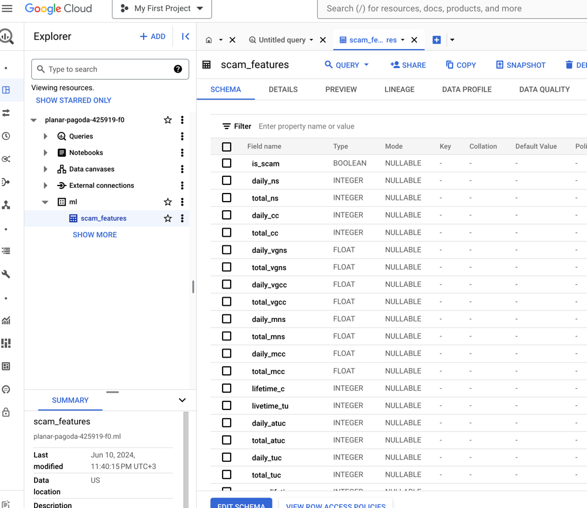
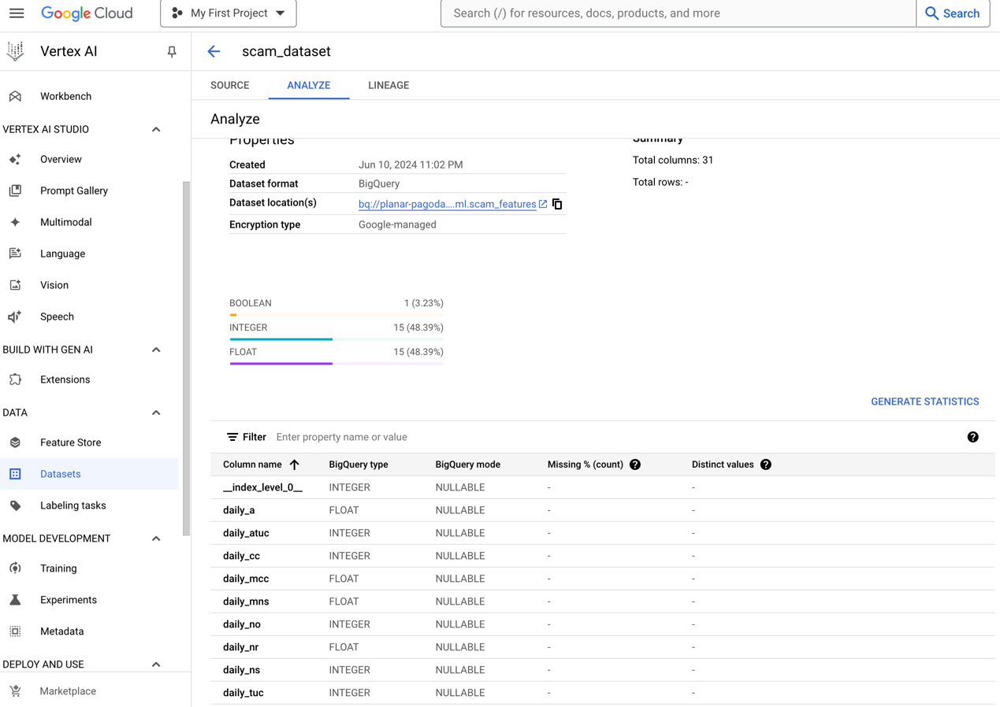
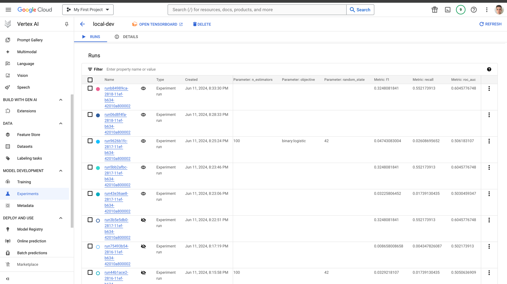
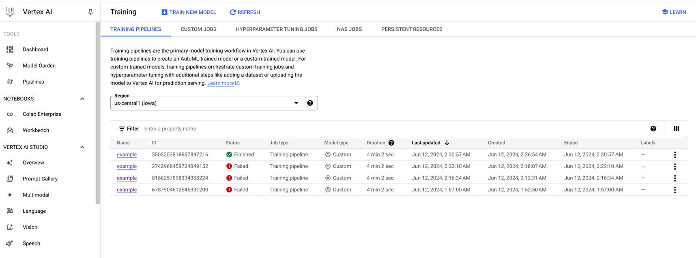
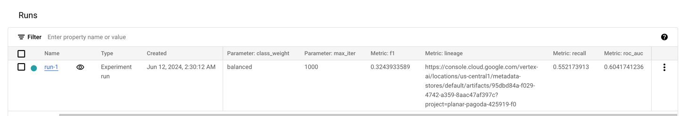
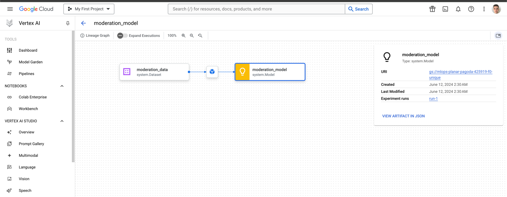

## HW 3

According to the project specification, VertexAI experiment tracking system was selected to track local/training service experiments.

So, in this homework:
1. Setup GCP environment to work with
2. Anonimized existing data and loaded features to the BigQuery table

3. Created managed dataset for this table

4. Implemented baseline local training on managed notebook with experiment tracking

5. Implemented training service and job submission logic for training on managed VertexAI service with custom parameters

